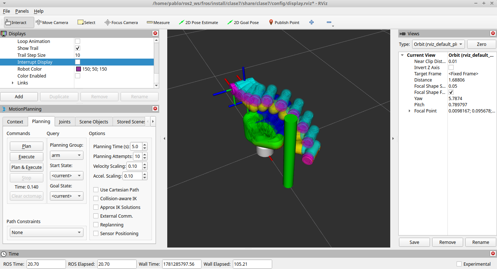

# Fundamentos de Robótica con ROS2
Este workspace de ROS2 provee los paquetes para estudiar y practicar los siguientes temas del curso:

- Sistemas de Referencias (clase 3) 
- Cinemática de Robots (clase 4) 
- Dinámica de Robots (clase 5)
- Control de Robots (clase 6)
- Planificación de Trayectoria (clase 7)

Las clases están formuladas como paquetes de ROS2.




## Contenedor Docker

El entorno de desarrollo está dockerizado para garantizar que todos trabajen con las mismas dependencias y versiones.

### Obtener la imagen

Opción A — Bajar la imagen lista (recomendado):

```bash
docker compose pull
```

Opción B — Construir la imagen localmente (para quienes quieran explorar el Dockerfile o modificar dependencias):

```bash
docker compose build
```

### Correr el entorno

Levantá el servicio en background:

```bash
docker compose up -d dev
```

Al arrancar, el contenedor automáticamente:

*    Instala las dependencias de los paquetes en src/
*    Compila el workspace con colcon build
*    Sourcea el entorno de ROS2

### Abrir una consola

Una vez levantado, abrí una terminal dentro del contenedor:

```bash
docker compose exec dev bash
```

Podés abrir tantas terminales como necesites ejecutando el mismo comando desde distintas ventanas, todas comparten el mismo contexto de ROS2.
Ejemplo — correr una simulación

```bash
# Terminal 1: lanzar la simulación
docker compose exec dev bash
ros2 launch clase6 sim_launch.py

# Terminal 2: interactuar con el sistema mientras corre
docker compose exec dev bash
ros2 topic list

Detener el contenedor
docker compose down
```


