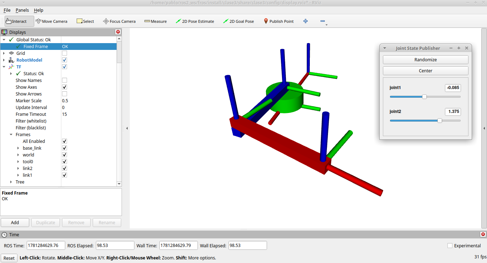

# Clase 3

## Objetivo

Mostrar un ejemplo práctico de sistemas de referencia en ROS 2 usando un doble péndulo en URDF, con publicación de TF y visualización en RViz.



## Contenido

- `launch/dp_launch.py`: arranca `robot_state_publisher`, `joint_state_publisher_gui` y RViz con la configuración de `config/display.rviz`.
- `robot_description/double_pendulum.urdf`: define la estructura del doble péndulo con dos eslabones y el frame de herramienta `tool0`.
- `config/display.rviz`: configuración de RViz usada por el lanzamiento.
- `scripts/static_tool_publisher.py`: publica un TF estático entre el frame `tool0` y `tool`.
- `scripts/tf_sampler.py`: muestrea el TF de `tool0` respecto a `base_link` durante 10 segundos y grafica las coordenadas X/Y.

## Compilación

```bash
colcon build --packages-select clase3 --symlink-install
source install/setup.bash
```

## Ejecución

1. En una terminal, iniciar el launch:

```bash
   ros2 launch clase3 dp_launch.py
```

2. En otra terminal, publicar el TF estático de la herramienta:

```bash
   ros2 run clase3 static_tool_publisher
```

3. En una tercera terminal, ejecutar el muestreador de TF:

```bash
   ros2 run clase3 tf_sampler
```

El launch carga el URDF en `robot_state_publisher`, abre el visualizador RViz y muestra el doble péndulo.

## Qué explorar

- `robot_description/double_pendulum.urdf`: la definición de links, joints `joint1` y `joint2`, y el frame `tool0`.
- `launch/dp_launch.py`: cómo se lee el URDF y se configura `robot_state_publisher` y RViz.
- `config/display.rviz`: qué elementos visuales se muestran en la sesión de RViz.
- `scripts/static_tool_publisher.py`: la transformada estática entre `tool0` y `tool`.
- `scripts/tf_sampler.py`: la lógica de `tf2_ros.Buffer`, `TransformListener` y el graficado final.
