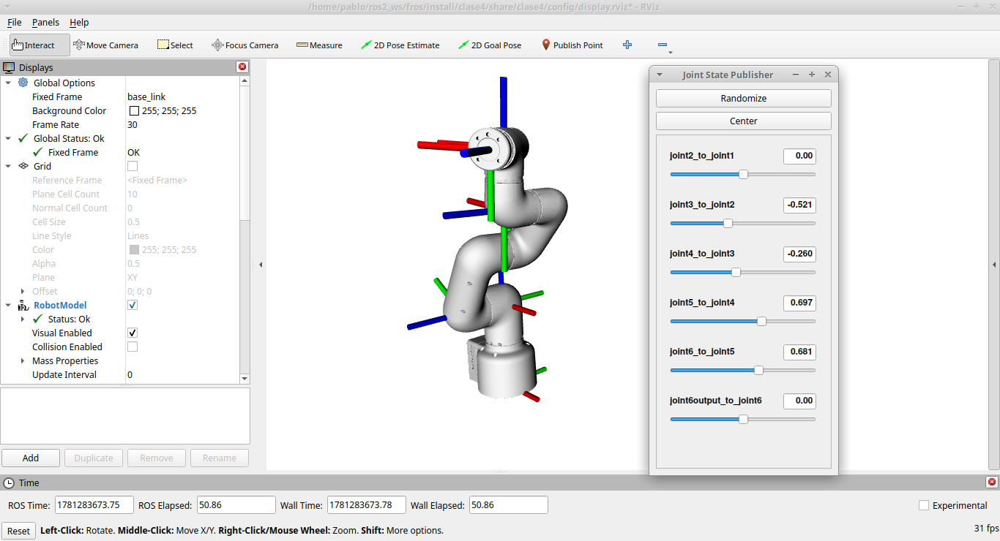
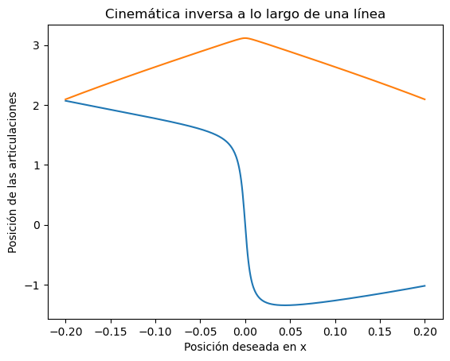

# Clase 4

## Objetivo

Esta clase muestra cómo cargar robots URDF/XACRO en ROS 2 con `robot_state_publisher`, usar `joint_state_publisher_gui` y visualizar el modelo en RViz. Incluye ejemplos de un doble péndulo y del robots myCobot 320 con adaptive gripper.



## Contenido

- `launch/dp_launch.py` — carga `robot_description/dp/double_pendulum.urdf` y arranca `robot_state_publisher`, `joint_state_publisher_gui` y RViz.
- `launch/dp_xacro.launch.py` — genera la descripción del doble péndulo desde `robot_description/dp_xacro/double_pendulum.urdf.xacro` antes de iniciar el mismo conjunto de nodos.
- `launch/robot_launch.py` — lanza `robot_state_publisher`, `joint_state_publisher_gui` y RViz para un URDF seleccionado mediante el argumento `robot`.
- `robot_description/dp/` — URDF del doble péndulo.
- `robot_description/dp_xacro/` — XACRO y URDF generado del doble péndulo.
- `robot_description/mycobot_320_m5_2022/` — URDF y archivos DAE del robot myCobot.
- `robot_description/adaptive_gripper/` — URDF y archivos DAE de un gripper adaptativo.
- `config/display.rviz` — configuración de RViz usada por los lanzadores.
- `scripts/cinematica_dp.ipynb` — notebook con material de cinemática para el doble péndulo.

## Compilación

```bash
colcon build --packages-select clase4 --symlink-install
source install/setup.bash
```

## Ejecución

Lanzar el doble péndulo desde el URDF directo:

```bash
ros2 launch clase4 dp_launch.py
```

Lanzar el doble péndulo desde XACRO:

```bash
ros2 launch clase4 dp_xacro.launch.py
```

Lanzar un URDF seleccionado en `robot_description/`:

```bash
ros2 launch clase4 robot_launch.py robot:=mycobot_320_m5_2022/mycobot_320_m5_2022.urdf
```

Otras variantes con URDFs disponibles:

```bash
ros2 launch clase4 robot_launch.py robot:=dp/double_pendulum.urdf
ros2 launch clase4 robot_launch.py robot:=mycobot_320_m5_2022/mycobot_320_m5_2022.urdf
```

## Qué explorar

- `launch/dp_launch.py` — carga directa del URDF del doble péndulo.
- `launch/dp_xacro.launch.py` — ejecución del XACRO en tiempo de launch.
- `launch/robot_launch.py` — argumento `robot` para seleccionar diferentes URDF.
- `robot_description/dp_xacro/double_pendulum.urdf.xacro` — plantilla XACRO y parámetros del doble péndulo.
- `robot_description/mycobot_320_m5_2022/` — estructura del robot MyCobot y archivos DAE.
- `config/display.rviz` — configuración de visualización del modelo en RViz.
- `scripts/cinematica_dp.ipynb` — notebook con ejemplos de cinemática del doble péndulo, con salida directa a ROS2 mediante la escritura de los topics /joint_states
- Explorar celda de configuraciones y de movimientos cercanos a la singularidades del doble péndulo

