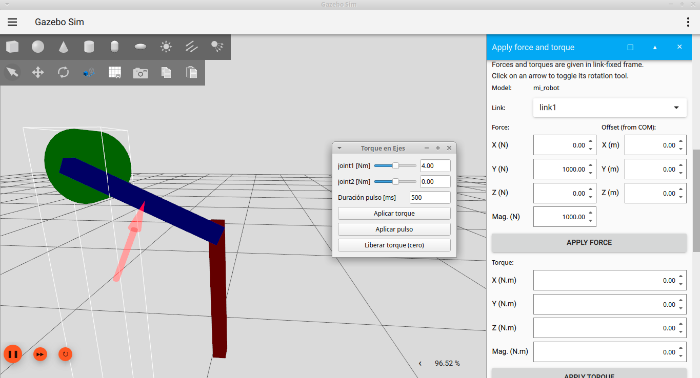
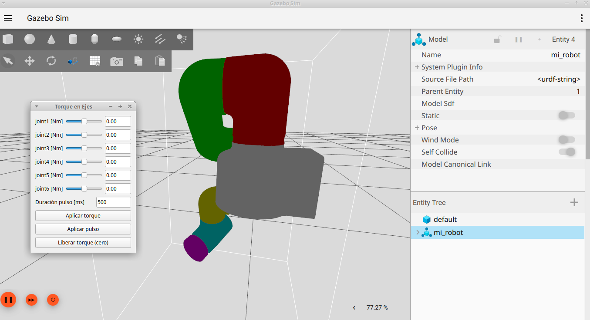

# Clase 5

## Objetivo

Este paquete contiene un launcher de simulación basado en `ros_gz_sim` para un robot definido en XACRO/SDF, una GUI de torque en Python y configuraciones de RViz/Gazebo. Permite cargar un mundo, spawnear el robot `mi_robot`, visualizar su modelo en RViz y enviar esfuerzos a las juntas mediante un nodo GUI.



## Contenido

- `launch/sim_launch.py` — Launch principal que inicia `ros_gz_sim`, `robot_state_publisher`, `ros_gz_bridge`, RViz y la GUI de torque.
- `scripts/gui_apply_torque.py` — Nodo Python que crea una interfaz PyQt5 y publica en tópicos de torque.
- `robot_description/dp/dp.xacro` y `robot_description/dp/dp_params.xacro` — Definición XACRO de un doble péndulo con dos juntas revolutas y plugins Gazebo para IMU, estado de juntas y aplicación de fuerzas.
- `robot_description/mycobot_320_m5_2022/mycobot_320_m5_2022.xacro` — Definición XACRO de un robot myCobot320 de 6dof y plugins Gazebo para estado de juntas y aplicación de fuerzas.
- `config/display.rviz` — Configuración de RViz usada por el launch.
- `config/gazebo.config` — Configuración de la GUI de Gazebo/GZ.
- `worlds/` — Mundos disponibles para la simulación:
  - `mundo_vacio.world`
  - `mundo_suelo.world`
  - `mundo_escritorio.world`
  - `mundo_obstaculos.world`
- `models/Desk/` — Modelo 3D de escritorio usado por Gazebo.

## Compilación

```bash
colcon build --packages-select clase5 --symlink-install
source install/setup.bash
```

## Ejecución

```bash
ros2 launch clase5 sim_launch.py
```

Argumentos opcionales:

```bash
ros2 launch clase5 sim_launch.py world_name:=mundo_escritorio.world xacro_file:=dp/dp.xacro use_sim_time:=true
```

Para correr el robot myCobot320

```bash
ros2 launch clase5 sim_launch.py world_name:=mundo_escritorio.world xacro_file:=mycobot_320_m5_2022/mycobot_320_m5_2022.xacro
```

Ejecutar la GUI de torque directamente:

```bash
ros2 run clase5 gui_apply_torque.py
```

## Qué explorar

- `launch/sim_launch.py` — flujo de lanzamiento, argumentos y nodos desplegados.
- `scripts/gui_apply_torque.py` — descubrimiento de joints desde `/joint_states` y publicación de `Float64` en tópicos de torque.
- `robot_description/dp/dp.xacro` — estructura del robot, links, juntas y plugins de Gazebo.
- `config/display.rviz` — visualización de `robot_description` y TF en RViz.
- `worlds/` — cambiar el mundo de simulación con `world_name` en el launch.
- Correr la simulación y ver cómo se cae el cobot y queda colgando el pobrecito

