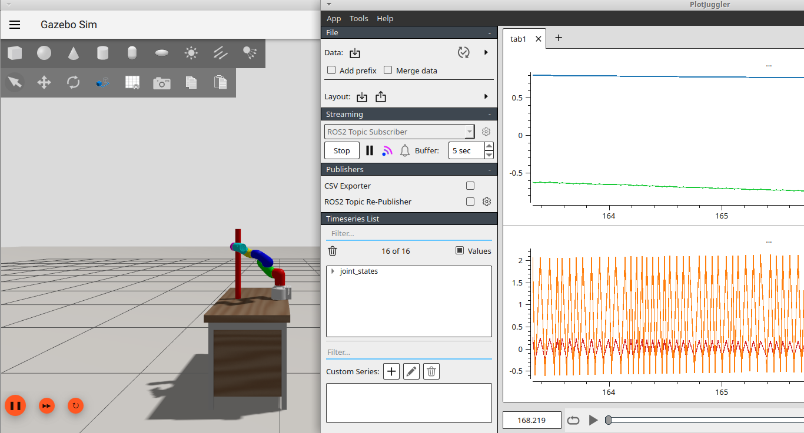

# Clase 7

## Objetivo

Ejecutar la simulación en Gazebo con ROS 2, MoveIt y visualización en RViz/PlotJuggler, mostrando cómo se articula la descripción del robot, el control y la planificación del

- doble péndulo
- cobot myCobot 300




## Contenido

- `launch/mycobot_launch.py`: arranca Gazebo, publica el URDF generado por Xacro, spawnea el robot en el mundo, lanza los controladores y MoveIt, y abre RViz y PlotJuggler.
- `launch/dp_launch.py`: ejemplo adicional de doble péndulo con Gazebo, `robot_state_publisher` y control ros2_control.
- `robot_description/mycobot_320_m5_2022/mycobot_320_m5_2022.xacro`: definición del robot myCobot 320 M5 con componentes visuales, cinemática y configuración de control.
- `config/mycobot_320_m5_2022/ros2_controllers.yaml`: parámetros de los controladores que se cargan en el launch.
- `config/display.rviz`: configuración de RViz usada por el launch principal.
- `config/plotjuggler_layout.xml`: layout de PlotJuggler para monitoreo de topics.
- `worlds/`: mundos disponibles para Gazebo, incluyendo `mundo_escritorio.world` usado por defecto.
- `scripts/move_to_pose.py` y `scripts/move_to_joints.py`: clientes de MoveIt que envían consignas de pose y de posiciones articulares.

## Compilación

```bash
colcon build --packages-select clase7 --symlink-install
source install/setup.bash
```bash

## Ejecución

- Simulación principal del myCobot con Gazebo, MoveIt, RViz y PlotJuggler:

```bash
  ros2 launch clase7 mycobot_launch.py
```

- Cambiar el mundo de Gazebo:

```bash
  ros2 launch clase7 mycobot_launch.py world_name:=mundo_obstaculos.world
```  

- Ejemplo alternativo del doble péndulo:

```bash
  ros2 launch clase7 dp_launch.py
```  

- En otra terminal, enviar un objetivo de pose con MoveIt:

```bash
  ros2 run clase7 move_to_pose
```

- En otra terminal, enviar un objetivo de joints con MoveIt:

```bash
  ros2 run clase7 move_to_joints
```

## Qué explorar

- `launch/mycobot_launch.py`: cómo se arma el flujo completo de Gazebo, controladores, MoveIt y visualización.
- `robot_description/mycobot_320_m5_2022/mycobot_320_m5_2022.xacro`: estructura del robot y parámetros de los links/joints.
- `config/mycobot_320_m5_2022/ros2_controllers.yaml`: definición de los controladores que se cargan en `controller_manager`.
- `config/mycobot_320_m5_2022/moveit`: configuraciones varias de la planificación de trayectorias.
- `worlds/mundo_escritorio.world` y `worlds/mundo_obstaculos.world`: el entorno físico de la simulación.
- `scripts/move_to_pose.py` y `scripts/move_to_joints.py`: clientes de acción MoveIt que muestran planificación desde el launch.

